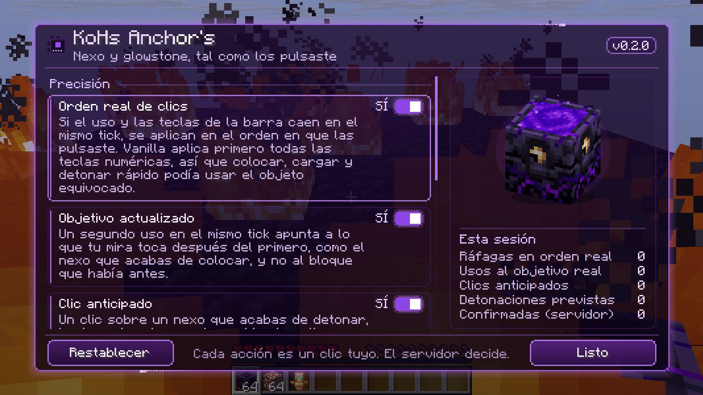
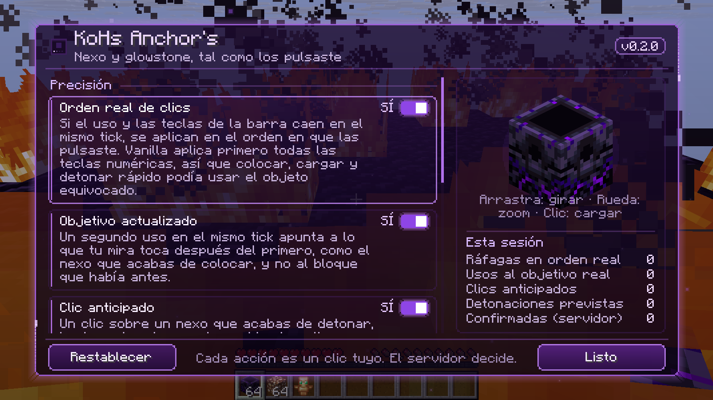
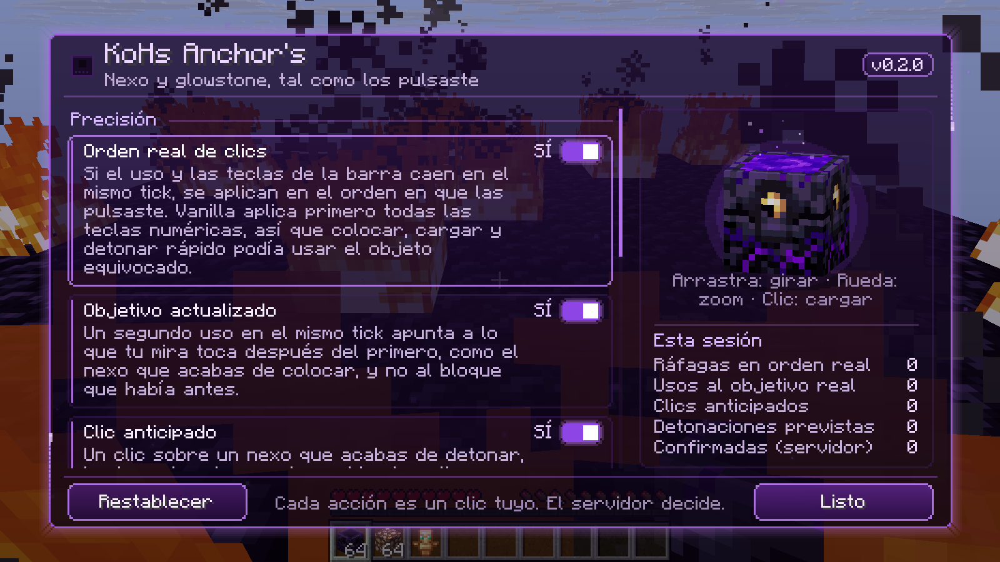
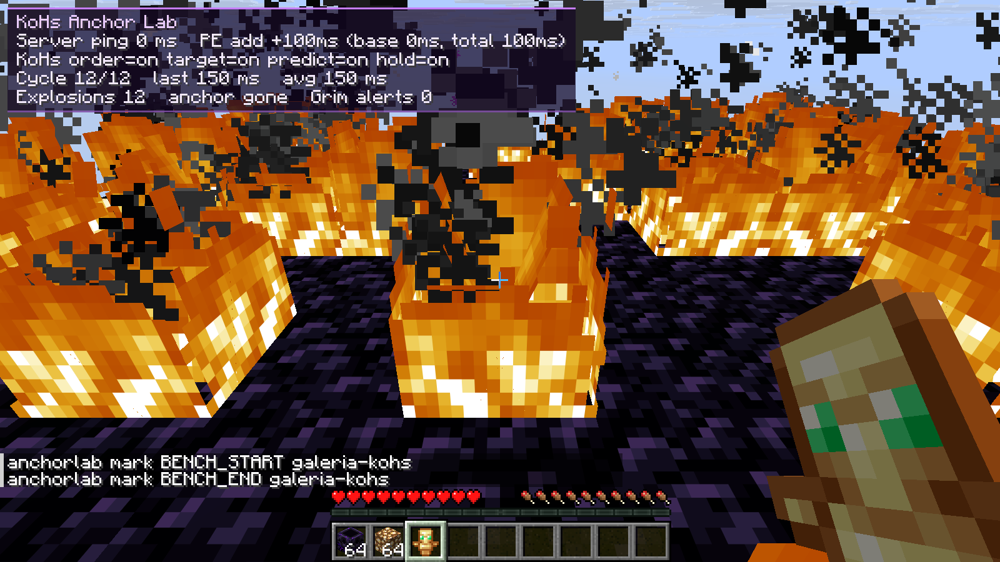
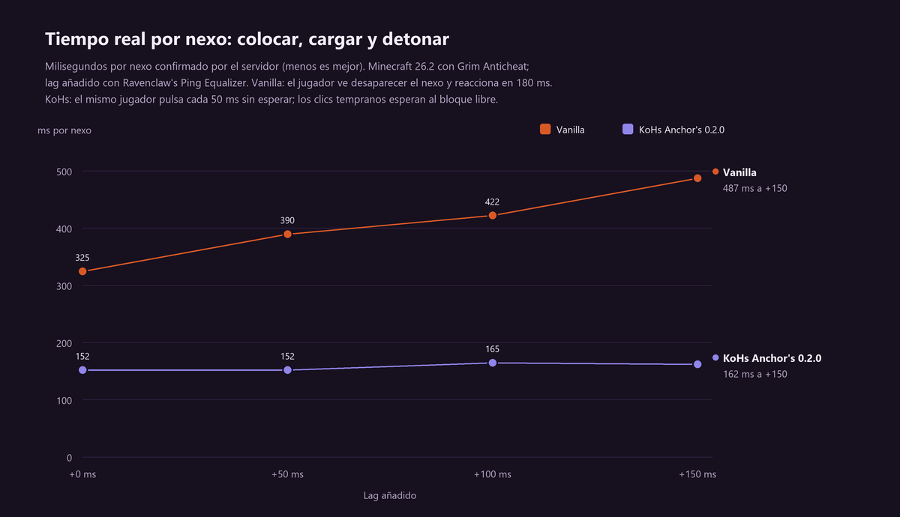
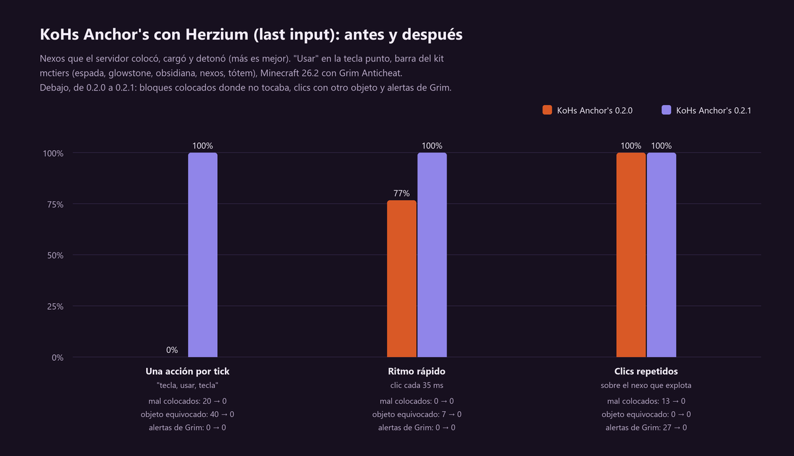

# KoHs Anchor's

[](https://github.com/kerlycanelita/KoHs-Anchors)
[](https://github.com/kerlycanelita/KoHs-Anchors/issues)
[](https://discord.gg/9t2VxEF7UU)

<p align="center">
  
</p>

**Respawn anchor and glowstone clicks land in the order you pressed them, on the block you are
actually looking at.**

## About

Minecraft only counts key presses between ticks. When a tick handles them it applies every
number key first and every use press afterwards, all aimed at the block the crosshair was on
before any of them. A fast *place anchor → glowstone → detonate* that fits in one tick can
therefore charge with the wrong item or aim the glowstone at the floor under the anchor you just
placed: the click is lost. KoHs Anchor's keeps the order and the target you actually gave it.

> **Status: 0.2.1, development build.** Measured on Minecraft 26.2 against a local server with
> Grim Anticheat and up to 150 ms of added latency (see below). Every other version compiles and
> has each Mixin target checked against its bytecode, but only 26.2 has been played.

## Screenshots

<p align="center">
  
</p>

| Idle | Turned with the mouse | Anchor lab |
| --- | --- | --- |
|  |  |  |

## What it changes

- **Pressed order.** When use and hotbar keys land in the same tick, they are applied in the
  order you pressed them, and the last number key you pressed is the one left selected. Only a
  burst whose number keys all come before its uses, and all pick the same slot, is left to the
  game, because every hotbar order gives it the same result. This also keeps anchor bursts right
  next to hotbar-order mods such as Herzium.
- **Fresh target.** A second use in the same tick, after you switched items, aims at what your
  crosshair hits after the first one, such as the anchor you just placed, using Minecraft's own
  raycast. A repeat with the same item keeps its target, so a double click never stacks an anchor.
- **Early clicks wait.** A click on an anchor you just detonated, made before the server has
  removed it, waits and lands the moment the server's removal arrives, aimed at the free block
  and with the item you pressed it with. Vanilla spends it on the old anchor and loses it, so you
  can place the next anchor without waiting to see the explosion. Clicking again with the same
  item while it waits does not stack a second anchor: the repeat joins the waiting click.
- **No stacked anchors.** A second click with the same item in the same tick is a double click:
  with anchors it can only fail or, on grass, snow or the fire an explosion leaves, stack a second
  anchor on the first. It joins the first one. Charging with glowstone is not limited.
- **Instant detonation.** Using a charged anchor where anchors explode plays the explosion's
  sound and flash on that tick instead of a round trip later. When the server's explosion arrives
  for the same block its sound and flash are not repeated; its debris, knockback and block
  changes apply as always.
- **Anchor explosion debris.** Optional: hide the block-debris particles of anchor explosions to
  save frames in anchor fights. Other explosions keep theirs.

## Measured on a server



The KoHs Anchor lab drives the game through Minecraft's own keyboard and mouse handlers against
a local 26.2 server running Grim Anticheat, with latency added by Ravenclaw's Ping Equalizer, and
times what the server actually did with every click.

| Added latency | Vanilla, waiting and reacting | Vanilla, clicking every 50 ms | KoHs Anchor's 0.2.0, clicking every 50 ms |
| --- | --- | --- | --- |
| +0 ms | 325 ms per anchor | 150 ms, 100 % | **152 ms, 100 %** |
| +100 ms | 422 ms per anchor | 207 ms, 70 %, 6 Grim alerts | **165 ms, 100 %, no alerts** |
| +150 ms | 487 ms per anchor | 157 ms, 70 %, 2 Grim alerts | **162 ms, 100 %, no alerts** |

Across the whole run, 0.2.0 wasted no click and raised no Grim alert. The full method, every
number and what was tried and rejected are in the
[lab write-up](docs/research/laboratorio-servidor-0.2.0.md) (in Spanish).

Next to Herzium's last-input hotbar order, with "use" on a keyboard key, 0.2.0 let a click pressed
between two number keys take the second key's item: anchors went down as glowstone blocks. 0.2.1
lands every such click with the item it was pressed with: 100 % of anchors in every test, no
misplaced block and no Grim alert ([write-up](docs/research/nexo-y-herzium-0.2.1.md), in Spanish).



## What it never does

Every action is one press Minecraft already counted. The mod never creates or repeats a press,
never selects a slot you did not press, never touches the repeat delay of a held key, never
writes a packet of its own, never extends reach and never changes a block in your world. The
only press that runs later than Vanilla would run it is an early click on a detonating anchor:
at most six of them wait, for at most 0.7 s, and each one is applied at most once. A repeat of
the waiting click, and waiting clicks whose anchor the server never removes, are not applied;
Vanilla would have spent them on that same anchor. Damage, knockback, blocks and the explosion
itself are decided by the server.

Reordering is only used for anchor play: an anchor or glowstone in hand or in a pressed slot, or
the crosshair on an anchor. Bursts that also open the inventory, swap hands, drop, attack or aim
at a container are left entirely to Vanilla.

## Settings

With [Mod Menu](https://modrinth.com/mod/modmenu) installed, open *Mods → KoHs Anchor's*. The
screen is a purple glass panel over a transparent purple veil. Its preview is a real respawn
anchor drawn by the game's own block renderer: drag to turn it, scroll to zoom, click to charge
it. Beside it are this session's numbers: bursts kept in pressed order, uses that landed on the
real target, early clicks that waited, and detonations shown instantly and then confirmed by the
server. Every option, and the screen's own animations, can be turned off. Settings live in
`config/kohs_anchors.json`.

## Supported versions

| Minecraft | Fabric Loader | Java |
| --- | --- | --- |
| 26.3 | 0.19.5 | 25 |
| **26.2** (focus) | 0.19.3 | 25 |
| 26.1.2, 26.1.1, 26.1 | 0.18.6 | 25 |
| 1.21.11 | 0.18.4 | 21 |

Client-side only. Fabric API is not required. Each jar declares exactly one Minecraft version.

## Install

1. Install Fabric Loader for your Minecraft version (see the table above).
2. Place the matching `kohs-anchors-<minecraft>-<version>.jar` in the instance's `mods` folder.
3. Optionally install Mod Menu to open the settings from the mod list.

## Compatibility and multiplayer

KoHs Anchor's works next to hotbar-order mods such as Herzium: anchor bursts are applied in pressed
order before the hotbar pass, whatever order that mod prefers. Do not combine it with another mod
that reorders or holds anchor clicks.

Server rules differ. Review the rules of every multiplayer server and obtain staff approval when
required; this project cannot guarantee acceptance by every server or anticheat. Every action is a
click you made, the server stays authoritative over every anchor, and the lab measured no Grim
alert with 0.2.1.

## Building

```powershell
.\gradlew.bat build "-Pmc=26.2"
```

Quote the `-P` argument in PowerShell. The jar is written to
`build/libs/kohs-anchors-<minecraft>-<mod_version>.jar`; the one ending in `-sources.jar` is not
the playable build. `build` also runs `checkLayout`, which fits the settings screen to every GUI
size from 240 × 140 to 1600 × 1000 and fails on any overlap or clipped region.

```powershell
powershell -ExecutionPolicy Bypass -File tools\build-all.ps1
```

builds every version, checks every Mixin target against that version's Minecraft bytecode
(`tools/verify_mixin_targets.py`) and copies the jars with their checksums to
`dist/<mod_version>/`.

## Repository layout

| Location | Contents |
| --- | --- |
| `src/client/java/` | The mod, written against Minecraft 26.2. |
| `src/compat/classic/`, `src/compat/legacy/` | The few calls spelled differently on 26.1.x and 1.21.11. |
| `src/main/resources/` | Metadata, icon and translations (English and Spanish). |
| `src/layoutCheck/` | The settings screen's geometry check. |
| `gradle/versions.properties` | The build matrix. |
| `tools/` | Build-all script and the Mixin target verifier. |
| `docs/` | Research, the server lab write-up and its images. |

Start with the [documentation index](docs/README.md).

## Support

- [Read the documentation](docs/README.md)
- [Report a problem](https://github.com/kerlycanelita/KoHs-Anchors/issues/new)
- [Join the Discord server](https://discord.gg/9t2VxEF7UU)

## License

MIT. See [LICENSE](LICENSE).

## Credits

Made by **zymekoh**.
