# KoHs Anchor's

[](https://github.com/kerlycanelita/KoHs-Anchors)
[](https://github.com/kerlycanelita/KoHs-Anchors/issues)
[](https://discord.gg/9t2VxEF7UU)

<p align="center">
  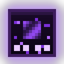
</p>

**Respawn anchor and glowstone clicks land in the order you pressed them, on the block you are
actually looking at. And your anchors glow the way you want them to.**

## About

Minecraft only counts key presses between ticks. When a tick handles them it applies every
number key first and every use press afterwards, all aimed at the block the crosshair was on
before any of them. A fast *place anchor → glowstone → detonate* that fits in one tick can
therefore charge with the wrong item or aim the glowstone at the floor under the anchor you just
placed: the click is lost. KoHs Anchor's keeps the order and the target you actually gave it, sends
it in the shape Vanilla sends it, and never adds a click of its own.

On top of that, 0.4.0 lets you make the anchor yours: paint it, light it, give the enemy's anchors
their own colour and pick the sounds you hear.

> **Status: 0.4.0**, on [GitHub Releases](https://github.com/kerlycanelita/KoHs-Anchors/releases).
> Measured on Minecraft 26.2 against a local server with
> Grim Anticheat (see below). Every other version compiles and has each Mixin target checked
> against its bytecode, but only 26.2 has been played.

## Gallery

<p align="center">
  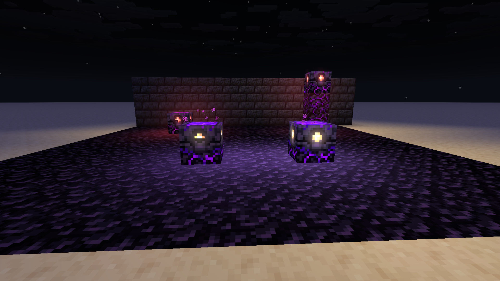
</p>

| | |
| --- | --- |
| 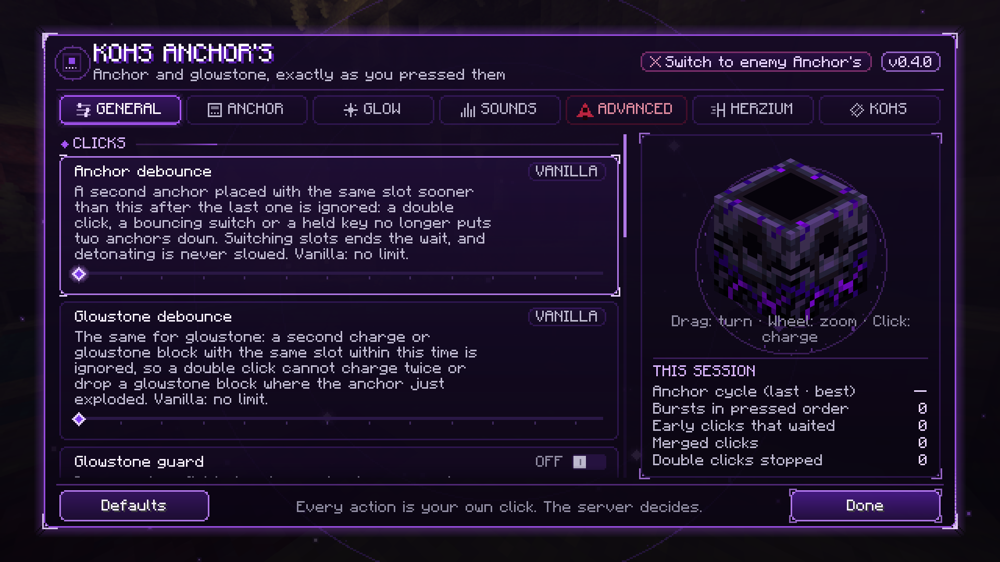 | 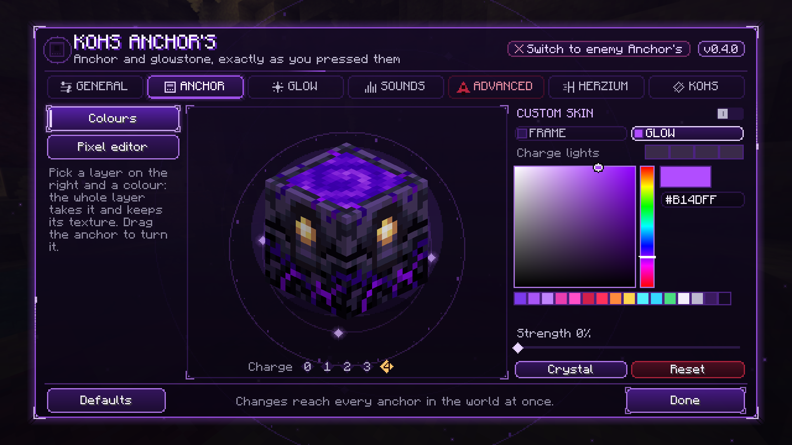 |
| **General**: debounce, glowstone guard, detonation and what is always on. | **Anchor custom**: colour the frame and the glow, or paint them pixel by pixel. |
| 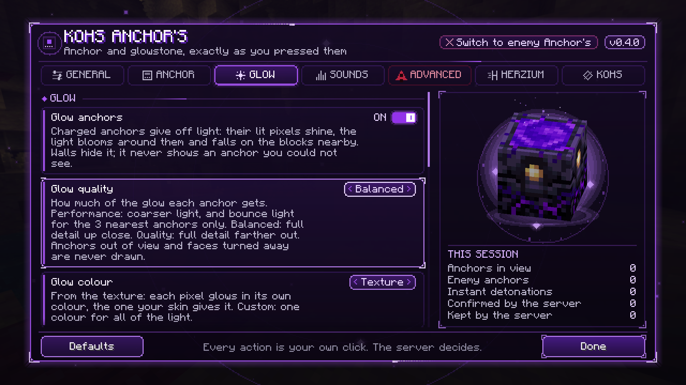 | 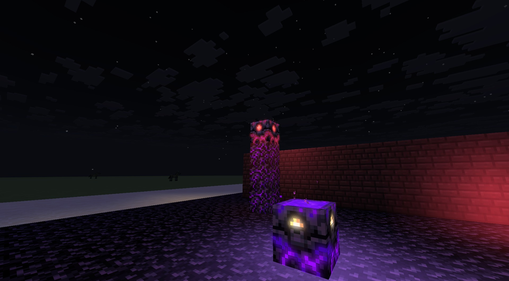 |
| **Glow anchors**: power, bloom, light on the surroundings and quality. | The light spreads through the air: down a pillar, onto the floor and the walls. |
| 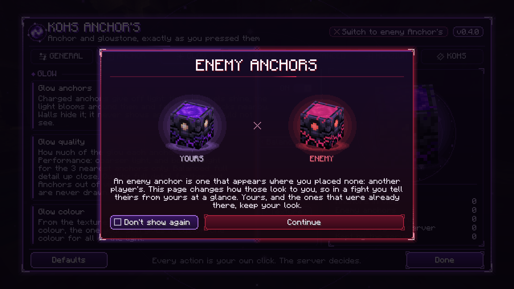 | 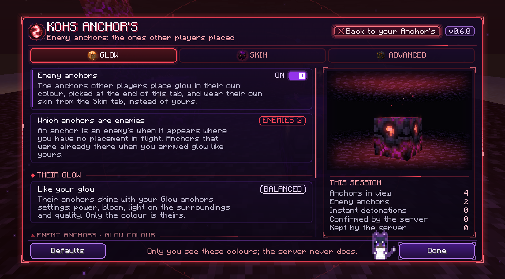 |
| **Enemy anchors**: yours and the other players', told apart at a glance. | Their side turns the whole screen red, with three tabs and their anchor as the world draws it. |
| 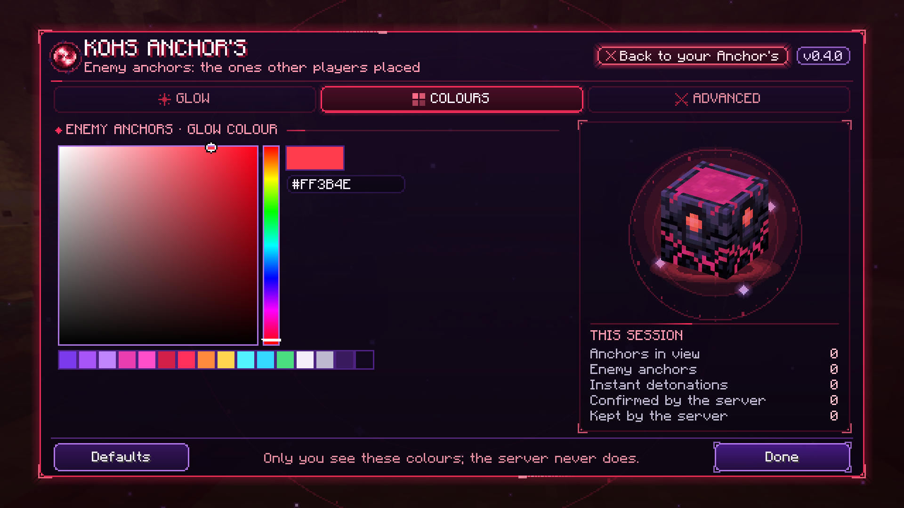 | 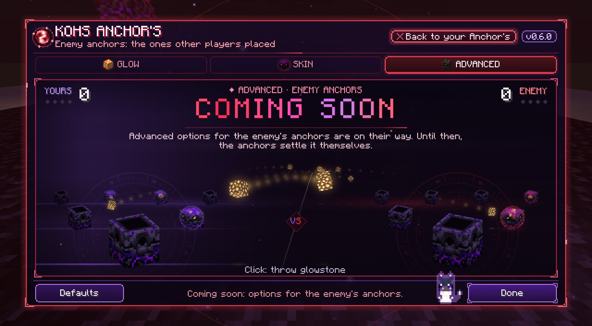 |
| **Colours**: the colour their anchors glow in. | **Advanced** is coming soon; until then your anchors and theirs fight it out with glowstone. |
| 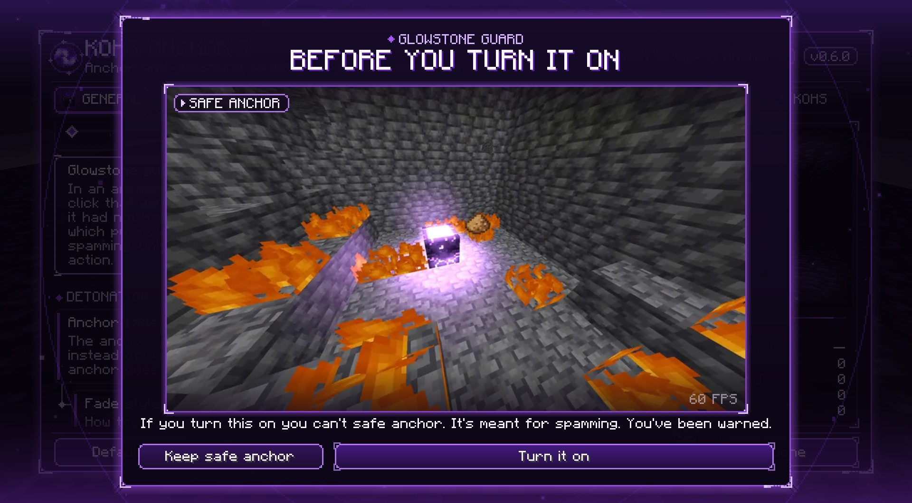 | 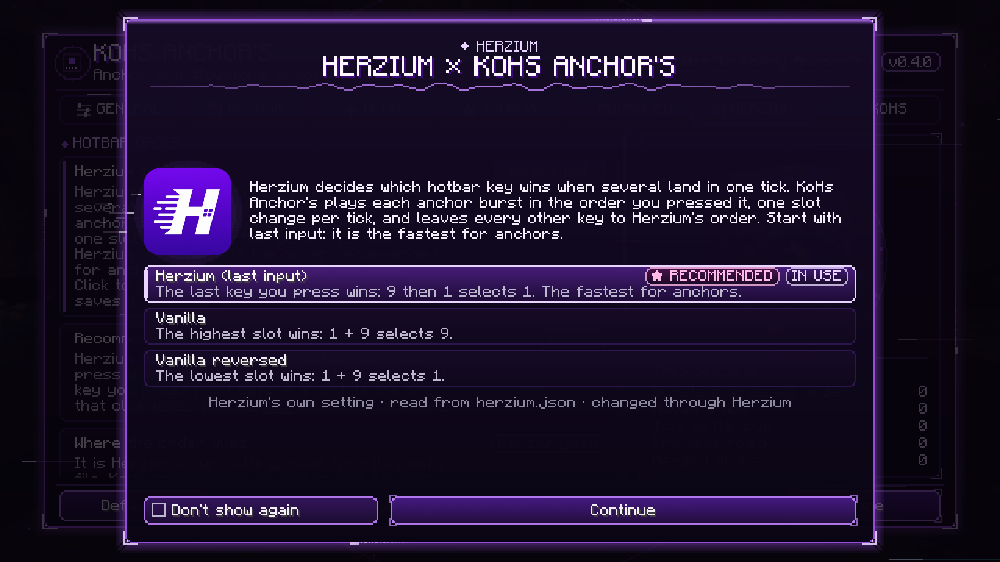 |
| **Glowstone guard** shows what it takes away, a safe anchor clip at 60 fps, before it turns on. | **Herzium**: its hotbar order, read from Herzium itself, and how the two mods talk. |
| 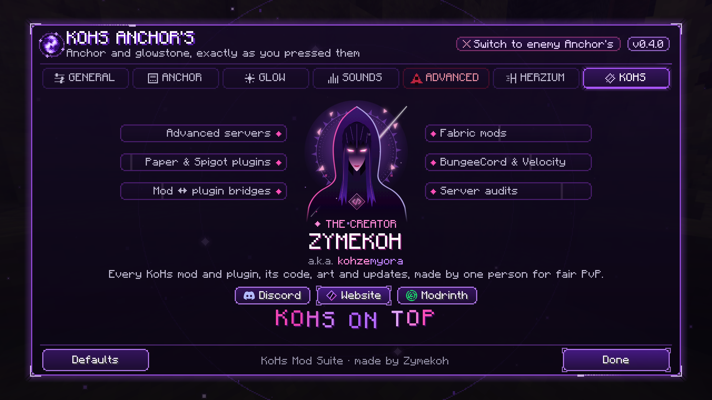 |  |
| **KoHs**: who makes the mod, with Discord, the site and Modrinth. | The KoHs Anchor lab, against a Grim server with added latency. |

## What it changes

### Always on

What made KoHs Anchor's land your clicks right is no longer optional.

- **Pressed order.** When use and hotbar keys land in the same tick, they are applied in the
  order you pressed them, and the last number key you pressed is the one left selected. Only a
  burst whose number keys all come before its uses, and all pick the same slot, is left to the
  game, because every hotbar order gives it the same result.
- **Vanilla's tick shape.** A burst goes out one slot change per tick, before that tick's clicks,
  as Vanilla sends it when the presses are a tick apart: "anchor, use, glowstone, use, sword, use"
  inside one tick lands on three consecutive ticks. Anticheats that read a tick's packets
  (Grim's `PacketOrderE` and `MultiPlace`) have nothing to see.
- **Fresh target.** A second use in the same tick, after you switched items, aims at what your
  crosshair hits after the first one, such as the anchor you just placed, using Minecraft's own
  raycast. A repeat with the same item keeps its target, so a double click never stacks an anchor.
- **Early clicks wait.** A click on an anchor you just detonated, made before the server has
  removed it, waits and lands the moment the server's removal arrives, aimed at the free block
  and with the item you pressed it with. Vanilla spends it on the old anchor and loses it.
- **No stacked anchors.** A second click with the same item in the same tick is a double click:
  it joins the first one instead of stacking a second anchor on grass, snow or the fire an
  explosion leaves. Charging with glowstone is not limited.
- **Instant detonation effects.** Using a charged anchor where anchors explode plays the
  explosion's sound and flash the moment you press use, instead of a tick and a round trip later.

### Detonation

- **Hide detonated anchor.** The anchor you detonate disappears at once, with its outline and its
  light, instead of standing there until the server's explosion arrives. Only the drawing changes:
  the block, its collision and everything the server sees stay as they are, and it comes back at
  once if the server keeps it.
- **Explosion debris and smoke.** Turn off the block debris of anchor explosions, and choose their
  smoke: Vanilla, one light puff, or none (the cloud hides the other player in a chain). Other
  explosions keep theirs.

### Clicks

- **Anchor and glowstone debounce.** A second anchor (or glowstone) with the same slot sooner than
  the time you pick is ignored: a double click, a bouncing switch or a held key no longer puts two
  down. Switching slots ends the wait, and detonating is never slowed. Off (Vanilla) by default.
- **Glowstone guard.** In an anchor fight, glowstone only charges anchors: a click that would put
  it down as a block is dropped. It rules out the safe anchor, so it is off by default, and turning
  it on first shows you a safe anchor clip, then charges an anchor to confirm.

### Anchor custom

A workshop with the 3D anchor in the middle. Colour its two layers (the obsidian frame and
everything that glows) while keeping their texture, give each charge light its own colour, or
switch to the pixel editor and paint them with a brush, an eraser, an eyedropper and a fill, with
undo. It reads the anchor texture of your resource pack, and the skin reaches every anchor in the
world at once. With **KoHs Crystal Tweaks** installed, one click takes the anchor's colours from
your crystal colours and keeps them in step.

### Glow anchors

Charged anchors give off light: their lit pixels shine even in the dark, the light blooms around
them in the shape of those pixels (four charge lights bloom as four), and it falls on the floor,
walls and ceiling nearby, spreading through the air like the game's own light: round corners and
down the pillar an anchor stands on. It grows with the charge and breathes slowly, each anchor on
its own beat. Walls hide it, so it never shows an anchor you could not see. Three qualities trade
detail for frames; anchors out of view and faces turned away are never drawn.

**Enemy anchors**, the ones that appear where you placed none, glow in a colour of their own. The
header's switch turns the screen to their side: your anchor rises, the screen turns red, theirs takes
its place, and three tabs of their own appear: **Glow**, **Colours** and **Advanced**. Advanced is
coming soon; until then it shows your anchors and theirs throwing glowstone at each other, in three
layers, with a detonation on every fifth hit. Click to throw one yourself.

### Sounds

Replace the charge and explosion sounds of anchors with any sound the game knows, including a
resource pack's, with their own volume and pitch, and listen before you keep them.

### Herzium

With [Herzium](https://modrinth.com/mod/herzium), its tab shows Herzium's hotbar order, read from
Herzium's own config and changed through Herzium, and recommends **last input** for anchors.
*Better communication with Herzium orders* tells Herzium about the hotbar keys an anchor burst
applies, and drops Herzium's hotbar preview when a burst is about to use another item, so the hotbar
always shows the item in use. Without Herzium, the tab says where to get it.

## Measured on a server


The KoHs Anchor lab drives the game through Minecraft's own keyboard and mouse handlers against
a local 26.2 server running Grim Anticheat, with latency added by Ravenclaw's Ping Equalizer, and
times what the server actually did with every click.

| Added latency | Vanilla, waiting and reacting | Vanilla, clicking every 50 ms | KoHs Anchor's 0.2.0, clicking every 50 ms |
| --- | --- | --- | --- |
| +0 ms | 325 ms per anchor | 150 ms, 100 % | **152 ms, 100 %** |
| +100 ms | 422 ms per anchor | 207 ms, 70 %, 6 Grim alerts | **165 ms, 100 %, no alerts** |
| +150 ms | 487 ms per anchor | 157 ms, 70 %, 2 Grim alerts | **162 ms, 100 %, no alerts** |

Across the whole run, 0.2.0 wasted no click and raised no Grim alert
([lab write-up](docs/research/server-lab-0.2.0.md)). Next to Herzium's last-input hotbar order,
0.2.1 landed 100 % of anchors with no misplaced block and no Grim alert
([write-up](docs/research/anchors-and-herzium-0.2.1.md)), and 0.4.0, with its per-tick shape, did
the same against Grim in its strict configuration ([0.4.0 notes](docs/research/anchors-0.4.0.md)).

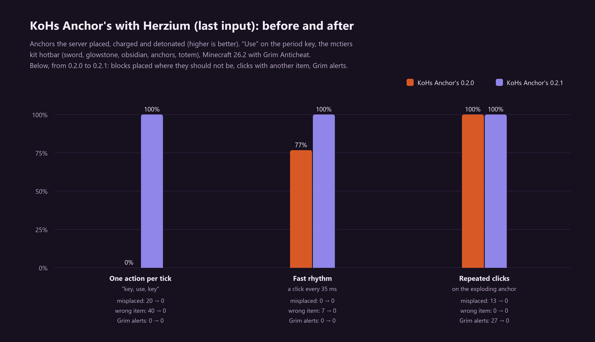

## Advanced options (not secure)

The crimson **Advanced · not secure** tab holds two options that are off by default. They change
when your clicks reach the server, so anticheats such as Grim may flag them and many servers
forbid them.

- **No-wait chain**: clicks on an exploding anchor go out at once instead of waiting for the
  server, and the next anchor, its charge and its explosion are drawn at once. It never places a
  glowstone block where an anchor should be and never stacks anchors.
- **Instant detonation click**: a click that detonates an anchor is sent the moment you press
  it, between game ticks, up to 50 ms sooner.

Turning one on takes two warnings. Even then they only act in singleplayer, on your local network
and on servers you allow one by one; anywhere else they stay suspended and you are asked once per
connection. Where you allowed them is never saved. The fair-play and anticheat analysis of each is
in [advanced-options-0.3.0.md](docs/research/advanced-options-0.3.0.md).

## What it never does

Every action is one press Minecraft already counted. The mod never creates or repeats a press,
never selects a slot you did not press, never touches the repeat delay of a held key, never
writes a packet of its own, never extends reach and never changes a block in your world. Presses
run later than Vanilla would run them in two cases only: the rest of a burst that waits for the next
tick to keep Vanilla's tick shape, and an early click on a detonating anchor (at most six wait, for
at most 0.7 s, each applied at most once). Debounce and glowstone guard only ever remove your own
clicks. Damage, knockback, blocks and the explosion itself are decided by the server.

Reordering is only used for anchor play: an anchor or glowstone in hand or in a pressed slot, or
the crosshair on an anchor. Bursts that also open the inventory, swap hands, drop, attack or aim
at a container are left entirely to Vanilla.

## Settings

With [Mod Menu](https://modrinth.com/mod/modmenu) installed, open *Mods → KoHs Anchor's*. The
screen is black-purple glass over a transparent veil with an anchor sigil turning behind it, in
seven tabs: General, Anchor custom, Glow anchors, Sounds, the crimson Advanced · not secure,
Herzium and KoHs; the header's switch turns it to the enemy's side, with three tabs of its own, and
its mark is a small Nether portal turning on itself. Beside the options, a real respawn anchor drawn by the game's own block renderer
turns inside a ritual circle that lights a node for every charge (drag to turn it, scroll to zoom,
click to charge it), above this session's numbers. Every animation can be turned off with
*Interface animations*. Settings live in `config/kohs_anchors.json`, the painted skin in
`config/kohs_anchors/`.

## Supported versions

| Minecraft | Fabric Loader | Java |
| --- | --- | --- |
| 26.3 | 0.19.5 | 25 |
| **26.2** (focus) | 0.19.3 | 25 |
| 26.1.2, 26.1.1, 26.1 | 0.18.6 | 25 |
| 1.21.11 | 0.18.4 | 21 |

Client-side only. Fabric API is not required. Each jar declares exactly one Minecraft version.

## Install

1. Install Fabric Loader for your Minecraft version (see the table above).
2. Download the matching `kohs-anchors-<minecraft>-<version>.jar` from
   [Releases](https://github.com/kerlycanelita/KoHs-Anchors/releases) (`CHECKSUMS.sha256` lists
   their SHA-256 sums) and place it in the instance's `mods` folder.
3. Optionally install Mod Menu to open the settings from the mod list.

## Compatibility and multiplayer

- **Herzium**: supported, see above. Herzium 1.10.6 or later agrees with KoHs Anchor's under every
  hotbar order.
- **KoHs Crystal Tweaks**: its colours can drive the anchor's skin and glow. KoHs Anchor's reads
  `config/crystal_tweaks.json` and never writes it.
- **Sodium**: the hidden detonated anchor also hides it from Sodium's chunk meshes.
- Do not combine it with another mod that reorders or holds anchor clicks.

Server rules differ. Review the rules of every multiplayer server and obtain staff approval when
required; this project cannot guarantee acceptance by every server or anticheat. Every action is a
click you made, and the server stays authoritative over every anchor.

## Building

```powershell
.\gradlew.bat build "-Pmc=26.2"
```

Quote the `-P` argument in PowerShell. The jar is written to
`build/libs/kohs-anchors-<minecraft>-<mod_version>.jar`; the one ending in `-sources.jar` is not
the playable build. `build` also runs `checkLayout`, which fits the settings screen, its tabs and
its windows to every GUI size from 240 × 140 to 1600 × 1000 and fails on any overlap or clipped
region.

```powershell
powershell -ExecutionPolicy Bypass -File tools\build-all.ps1
```

builds every version, checks every Mixin target against that version's Minecraft bytecode
(`tools/verify_mixin_targets.py`) and copies the jars with their checksums to
`dist/<mod_version>/`. On Linux and macOS, `tools/build-all.sh` does the same. Publishing a
release on GitHub (or pushing a tag such as `v0.4.0`) runs it on GitHub Actions
(`.github/workflows/release.yml`) and attaches the jars and their checksums to the release, with
that version's changelog as its notes when it has none.

## Repository layout

| Location | Contents |
| --- | --- |
| `src/client/java/` | The mod, written against Minecraft 26.2. |
| `src/compat/classic/`, `src/compat/legacy/`, `src/compat/pearl/` | The few calls spelled differently on 26.1.x, 1.21.11 and 26.3. |
| `src/main/resources/` | Metadata, icon, textures, the safe anchor clip and translations (English and seven Spanish locales). |
| `src/layoutCheck/` | The settings screen's geometry check. |
| `gradle/versions.properties` | The build matrix. |
| `tools/` | Build-all script and the Mixin target verifier. |
| `docs/` | Research, the server lab write-ups and their images. |

Start with the [documentation index](docs/README.md).

## Support

- [Read the documentation](docs/README.md)
- [Report a problem](https://github.com/kerlycanelita/KoHs-Anchors/issues/new)
- [Join the Discord server](https://discord.gg/9t2VxEF7UU)

## License

MIT. See [LICENSE](LICENSE). The safe anchor clip is decoded with
[JCodec](https://github.com/jcodec/jcodec) (BSD 2-Clause, its license ships in the jar). The
Modrinth and Discord logos belong to their owners and only link to them.

## Credits

Made by **Zymekoh** (a.k.a. Kohzemyora) for the
[KoHs Mod Suite](https://kerlycanelita.github.io/KoHs-Mod-Suite/). KoHs on top.
