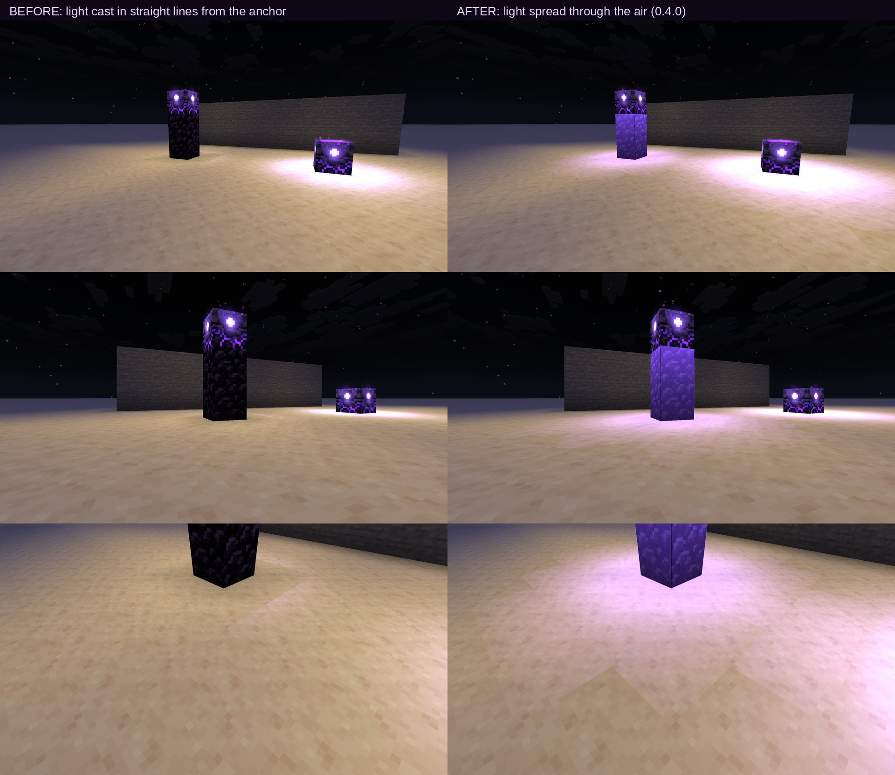

# KoHs Anchor's 0.4.0: tick shape, light and performance

Written on 30 September 2026 for 0.4.0. Each section says how it was checked: measured in the game,
measured in the KoHs Anchor lab, or true by construction (and then what in the code makes it so).
The measurements with Grim and Herzium are from 26.2; every version from 1.21.11 to 26.3 was then
played in the lab ([Tested on every version](#tested-on-every-version)), and every Mixin target is
checked against each version's bytecode by `tools/verify_mixin_targets.py`.

| Topic | What changed | How it was checked |
| --- | --- | --- |
| [Tick shape](#tick-shape-one-slot-change-per-tick-before-the-clicks) | A burst is sent one slot change per tick, before that tick's clicks | Lab, 26.2, Grim in its strict configuration |
| [Ghost light](#ghost-light) | A detonated anchor stops lighting its surroundings at the click | By construction |
| [Glow cost](#the-glow-light-that-costs-little) | View cone, back faces, levels of detail and a vertex budget | Measured in the game |
| [Light on the surroundings](#light-on-the-surroundings) | The light spreads through the air and reaches down a pillar | Screenshots, before and after |
| [Settings screen](#settings-screen-performance) | Shapes drawn from many spans get a GUI stratum of their own | Measured in the game |
| [Enemy anchors](#enemy-anchors-who-placed-it) | Own placements wait for the server's acknowledgement instead of a time window | Scripted test in the game |
| [Herzium](#herzium-better-communication) | The hotbar preview never shows an item a burst is not about to use | Measured tick by tick in the game, every era |
| [Server lock](#advanced-options-server-lock) | The not secure options only act where the player allowed them | By construction; server lab, every version |
| [Debounce and glowstone guard](#debounce-and-glowstone-guard) | Refused clicks fail before anything is predicted or sent | By construction |
| [Every version](#tested-on-every-version) | The settings screen, the anchor cycle, enemies, the glow under load and a dedicated server, from 1.21.11 to 26.3 | Lab, every version |
| [The Nether](#anchors-in-the-nether) | Setting the spawn is no longer taken for a detonation | Lab, every version |
| [26.3 input](#263-keys-and-buttons) | The settings screen answers to SDL's key and button numbers | Lab, 26.3 against 26.2 and 1.21.11 |
| [Chains through latency](#chains-on-one-hole-through-latency) | Held clicks wait for every anchor in their hole, overflow is dropped, a hitch keeps the pressed order | Server lab, 100 ms each way |

## Tick shape: one slot change per tick, before the clicks

A server, and anticheats such as Grim, read a client tick as the packets between two tick-end
packets. Vanilla never sends a slot change after a click of the same tick: its `handleKeybinds`
applies every number key before the first use. 0.2.x applied an anchor burst in pressed order inside
one tick, so "anchor, use, glowstone, use" sent *slot, use, slot, use* between two tick-ends:
exactly what Grim's experimental checks look for (`PacketOrderE`, a slot change during another
action, and `MultiPlace`, several placements in one tick).

0.4.0 keeps the pressed order and gives it Vanilla's shape. A burst is applied one stretch per tick:
number keys, then the uses that follow them. At the first number key that would change the slot after
a click, the rest of the burst waits for the next tick, still in pressed order and still in
Vanilla's own counters. "Anchor, use, glowstone, use, sword, use" pressed inside one tick lands on
three consecutive ticks, which is how Vanilla sends it when the presses are a tick apart. Presses
are never created, repeated or moved into an input callback; the ones that wait stay queued in
Vanilla's `KeyMapping` counters until their tick.

**Checked:** the 0.4.0 lab session on 26.2, against a local server running Grim Anticheat in its
strict configuration, landed **100 % of anchors next to Herzium's last-input order with 0 Grim
alerts**. The raw data of that session is not published yet; the method is the one in the
[0.2.1 write-up](anchors-and-herzium-0.2.1.md).

## Ghost light

A detonated anchor is drawn as air the moment it is used (*Hide detonated anchor*), but until 0.4.0 its
light stayed: a charged anchor gives off up to light level 15, and the blocks around it kept that
light for a round trip, lit by a block that was no longer shown.

0.4.0 feeds the veil to the client's light engine (`BlockLightEngineMixin`): while an anchor is
veiled, its emission is the emission of what is drawn, so the light goes out at the click and comes
back if the server keeps the anchor. Only the light engines of the client's chunk cache read it; the
integrated server's engines, which light the real world, never see it. While nothing is veiled the
check is one volatile read.

The veil itself now lifts after a wait that follows the connection: three round trips measured by
the server for this player plus a quarter of a second for its tick, within fixed bounds
(`Latency.answerWindowNanos`), instead of a fixed time.

## The glow: light that costs little

The glow draws three additive layers, all depth-tested so walls hide them: the anchor's lit pixels
at full strength, a bloom shaped by those pixels, and light on the blocks around it. Writing vertices
is where the frame goes, so 0.4.0 writes as few as it can:

- anchors outside the view cone are skipped, and so is every face, bloom and bounce light that turns
  its back to the camera;
- each quality (performance, balanced, quality) steps the bloom down with distance: full, half, a
  third and a quarter of its cells, at 4/12/24, 8/20/36 or 16/32/48 blocks;
- only the nearest 3, 8 or 16 anchors light the blocks around them, within 10, 16 or 24 blocks, and
  at most two of those lights are rebuilt per frame;
- past a vertex budget (40, 90 or 200 thousand), the rest of the frame's anchors take the lightest
  glow;
- the glow fades out between 48 and 64 blocks.

**Measured:** with 64 charged anchors in view, the frame went from 353 thousand glow vertices to a
fraction of that. The night scene in the [gallery](../../README.md#gallery), with four charged
anchors (two of them enemies) and default settings, draws 11 faces and 8,934 vertices a frame.

## Light on the surroundings

Until 0.4.0 the light on nearby blocks was measured in straight lines from the anchor's centre. On
top of a pillar, the block under the anchor blocked every line towards the ground: the pillar's sides
and the floor around it stayed dark, a hard shadow.

The light now spreads through the air like the game's own: from the air around the anchor, cell by
cell through all 26 neighbours with their real length (Dijkstra), never slipping through a diagonal
gap between two solid blocks, up to 4.6 blocks with a soft falloff. Every face that touches lit air
takes that air's light, averaged at its corners like Vanilla's smooth lighting and weighted towards
the anchor, and is drawn as 2×2 quads with bilinear light. The sides of a pillar and the floor two to
three blocks below are lit; walls still block.

## Settings screen performance

Minecraft places every GUI element by testing its bounds against the elements already in its
stratum. A ring, a soft glow or a gradient square is drawn from hundreds of spans, so every element
drawn after it tested all of them: quadratic work that cost the settings screen half its frame rate.
0.4.0 opens a new stratum before and after each such shape, and every 24 rows inside a large one
(`AnchorsUi.isolate`). What shows is unchanged: a later stratum is drawn over an earlier one, just as
a later element is drawn over what it overlaps.

The screen's animations are all timed with `System.nanoTime`, so they play at the same speed at any
frame rate, and each can be turned off with *Interface animations*.

The enemy anchors' Advanced tab draws a whole battle while its options are being made: fourteen
anchors, glowstone in flight, shockwaves, smoke and sparks. Every glow, ring and puff is one blit of
a small white mask tinted per draw instead of hundreds of spans, the anchors share one texture per
charge, and the fight is stepped with the real time between frames. **Measured** in the lab at
1920 × 1080 under a software renderer: 23 to 24 frames a second on the battle, against 21 to 28 on
the other tabs in the same run.

## Enemy anchors: who placed it

An anchor is an enemy's when it appears where the player has no placement in flight. 0.3.x did not
have enemy anchors; the first 0.4.0 builds marked a placement as the player's own for four seconds.
Two players using the same hole within those four seconds confused it.

0.4.0 stamps each own placement with the sequence number of the click's block prediction
(`ClientLevelPredictionAccessor`) and keeps it until the server acknowledges that sequence
(`handleBlockChangedAck`). The server sends a click's block updates before its acknowledgement, so an
anchor that arrives while its placement is pending is the player's, and one that arrives with nothing
pending is not. Both blocks a placement can take are stamped (the clicked block when it can be
replaced, and the one beside it), and anything still pending after five seconds is dropped.

**Checked** in a local world with a script: an anchor placed by the player (own), one placed by a
command (enemy), the player's hole reused by a command right after the player's anchor left it (enemy)
and by the player again (own). All four were classified correctly.

## Herzium: better communication

Herzium draws the hotbar slot a key will select before the tick applies it. When a KoHs Anchor's burst
goes on in the next tick, Herzium forecasts the rest of the burst with its own order, which can differ
from the pressed order KoHs Anchor's applies. With *Better communication with Herzium orders* (on by
default):

- each hotbar press KoHs Anchor's applies itself is reported to Herzium
  (`HotbarOrderController.hotbarClickConsumed`);
- at the end of a tick in which a burst goes on, Herzium's preview is compared with the slot the
  burst's next stretch selects (`ImmediateHotbarInput.visualSelectedSlot`) and dropped when they
  differ (`clearPreview`).

KoHs Anchor's never calls `noteCallSiteSelection`. Herzium keeps it for Vanilla's own hotbar pass and
reads a difference there as its own mistake, switching its preview off for the rest of the world: the
bug Herzium 1.10.6 fixed for KoHs Anchor's.

**Measured** on 26.2 with Herzium 1.10.7 in last-input order: "1, use, 2, use, 3, use" (anchor,
glowstone, sword) pressed within one tick through Minecraft's own key handler, reading at the start of
each tick the slot selected and the slot Herzium drew in the frames before.

| Tick | Off: selected | Off: Herzium drew | On: selected | On: Herzium drew |
| --- | --- | --- | --- | --- |
| 1 | 1 (anchor) | **3 (sword)** | 1 (anchor) | 1 (anchor) |
| 2 | 2 (glowstone) | 2 | 2 (glowstone) | 2 |
| 3 | 3 (sword) | 3 | 3 (sword) | 3 |

With the option on, two presses were reported and one preview dropped; Herzium never suspended its
preview. The burst itself was the same with the option on and off.

The lab repeated it on 1.21.11, 26.1.2, 26.2 and 26.3 with Herzium 1.10.7 in its own order: without
the communication Herzium drew the sword in the tick the anchor was placed, with it the anchor, and
every burst exploded its anchor either way.

## Advanced options: server lock

The two not secure options (*No-wait chain*, *Instant detonation click*) change when clicks reach the
server. In 0.4.0 being switched on is not enough:

- they act in singleplayer, on the local network and on servers the player allowed one by one;
- turning one on takes two warnings, the second one held down;
- on any other server they stay switched on but suspended, and the player is asked once per
  connection, with the server named;
- where they were allowed is kept in memory only: nothing about it is written to disk or shown, so
  every new session asks again.

This is the client protecting its player from a rule they may not know. It decides nothing for the
server and hides nothing from it.

**Checked** in the server lab on every version, with the no-wait chain on: through `127.0.0.1` the
chain acts; through a name that resolves to the same machine but is not local, the second warning
opens once with the name, Escape leaves the chain suspended, and holding "allow" lets it act.

## Debounce and glowstone guard

*Anchor debounce* and *Glowstone debounce* refuse a second placement (or charge) with the same slot
too soon after the last one: what a double click, a bouncing switch or a held key does. *Glowstone
guard* refuses glowstone that would go down as a block within four seconds of an anchor action; it
rules out the safe anchor, so it is off by default and turning it on shows the safe anchor clip first.

All three hook the use itself (`MultiPlayerGameMode.useItemOn`), so they cover whatever is bound to
"use". A refused click returns `FAIL` before anything is predicted or sent, exactly as if it had
never been pressed. They only ever remove the player's own clicks; detonations are never refused, and
switching slots ends the window.

## Tested on every version

Every supported version was played in the KoHs Anchor lab before the release: a development client of
that version under Xvfb at 1920 × 1080 and a software renderer (Mesa's llvmpipe; lavapipe's Vulkan on
26.3, whose OpenGL backend finds no GLX visual there), driven line by line by a lab script, with
presses sent through `KeyMapping.click` as the keyboard handler sends them.

| Run | What it does | 1.21.11 | 26.1 | 26.1.1 | 26.1.2 | 26.2 | 26.3 |
| --- | --- | --- | --- | --- | --- | --- | --- |
| Settings screen | Every tab, the sound picker, the three warnings, the Herzium and KoHs pages, the enemy side (intro, Glow, Colours, the battle), the glowstone guard window, GUI scales 1 to 4, and the screen over a world: 22 screenshots | ✓ | ✓ | ✓ | ✓ | ✓ | ✓ |
| World | A cycle key by key, a whole cycle inside one tick, anchor debounce, glowstone guard, glowstone debounce, and the four enemy cases, in singleplayer | 11/11 | 11/11 | 11/11 | 11/11 | 11/11 | 11/11 |
| Load | Interface animations off, 64 charged anchors at the three qualities, a resource reload with them in view | ✓ | ✓ | ✓ | ✓ | ✓ | ✓ |
| Nether | Setting the spawn twice with a charged anchor, then one more glowstone | 4/4 | 4/4 | 4/4 | 4/4 | 4/4 | 4/4 |
| Server | Against a vanilla dedicated server through 100 ms each way: a cycle key by key, a cycle inside one tick, four cycles 150 ms apart on one hole, the four enemy cases, the no-wait chain, the instant detonation click, anchor debounce, glowstone guard, the Nether | 16/16 | 15/16 | 16/16 | 16/16 | 15/16 | 15/16 |
| Server lock | The same server under a name that is not local: the warning, Escape, and holding "allow" | 2/2 | 2/2 | 2/2 | 2/2 | 2/2 | 2/2 |
| Keys and buttons | Sliders by arrow keys, Home and End, Ctrl+Z and Ctrl+Y in the workshop, typing and Backspace in the sound picker, Escape | ✓ | | | | ✓ | ✓ |
| Spanish | The main tabs, the KoHs page and the enemy side in Spanish, at three GUI scales | ✓ | | | | ✓ | ✓ |
| Herzium 1.10.7 | "Anchor, use, glowstone, use, sword, use" in one tick, the preview read tick by tick, with the communication off and on | ✓ | | | ✓ | ✓ | ✓ |

Each 15/16 is the no-wait chain, the advanced option that is off by default, leaving one of its
four cycles charged 0 ([Limits](#limits)). Herzium 1.10.7 needs Fabric Loader 0.19.3 or newer,
so on 1.21.11 and 26.1.2, whose development clients use an older one, it ran with Loader 0.19.5.

## Anchors in the Nether

A charged anchor explodes when used, except where anchors set the spawn point. The server decides that
with the `respawn_anchor_works` environment attribute, and the client-side prediction read the same
attribute. But the game syncs only the attributes marked for it, and this one is not: a client that
builds its dimensions from the server's registry data reads it as false in every dimension. The lab's
Nether test showed 1.21.11 doing so in singleplayer. Setting the spawn in the Nether was then taken
for a detonation: the explosion's sound and flash played, the anchor was hidden until the server
answered, and clicks aimed at it in the meantime waited and were dropped.

0.4.0 also asks the dimension: the Nether's own dimension type (which servers' extra Nether worlds
share) or the Nether itself means anchors work, and the attribute still counts where the client has
it. The same test now keeps the anchor through two set-spawn uses and a third glowstone on every
version, with no predicted detonation; in the End a detonation is still predicted.

## 26.3: keys and buttons

26.3 moved the game's input to SDL, and with it the numbers Minecraft gives keys, mouse buttons and
modifiers: the left button is 1 instead of 0, Escape is 41 instead of 256, Enter 40 instead of 257,
Ctrl 192 instead of 2. The settings screen compared GLFW's numbers, so on 26.3 no click on a row, tab
or window reached it, and Escape and Enter did nothing in its windows. Every key and button it answers
to now comes from Minecraft's own `InputConstants`, compiled into each version's jar.

## Chains on one hole, through latency

The server lab puts a vanilla dedicated server of each version behind a proxy that adds 100 ms each
way, and presses whole cycles (anchor, use, glowstone, use, sword, use, all at once) every 150 ms on
one hole: faster than any server can clear it, since each detonation takes a round trip and a server
tick, 250 to 400 ms here. Traced tick by tick, 0.4.0 held the next cycle's clicks and released them
in order once the hole was free, as designed, and then went wrong four ways:

- Clicks held for one anchor were all released once it was removed, one slot per tick. By the time
  the later ones ran, the cycle before them had already put, charged and detonated another anchor in
  the same hole, and they landed on it.
- With six clicks waiting, the next one ran at once onto the exploding anchor: an anchor beside the
  hole or, once its cycle was split this way, glowstone as a block in it.
- A half-second hitch of the client (the software renderer here; chunk loading or a collection on a
  real computer) aged presses the mod was carrying to the next tick past the journal's 250 ms limit,
  which handed them to Vanilla: number keys first, then three uses with the sword.
- When the server handled a cycle's glowstone and sword in one tick, it sent the anchor's removal
  before acknowledging the glowstone's prediction, and Vanilla keeps such a state aside until the
  acknowledgement, drawing the charged anchor meanwhile. The mod had already counted the anchor as
  gone: the clicks waiting for it were taken for clicks on an anchor the server kept and dropped,
  the next anchor click landed on it and put an anchor beside the hole, and the veil lifted to show
  the detonated anchor again until the acknowledgement.

Now a detonated anchor counts as exploding until the world stops drawing it (read after Vanilla
handled the server's state, and again after the acknowledgement); a released click that aims at
another exploding anchor waits for that one; a click that finds the wait full is dropped; a
released click must still do what it was pressed for (an anchor never on an anchor, glowstone never
as a block); and the journal is cleared when a screen or a world change releases the keys, keeping
its order through hitches of up to two seconds.

**Measured** in the server lab: five runs of ten cycles pressed 150 ms apart, three on 26.2 and two
on 1.21.11, detonated 47 anchors; the other three cycles were dropped whole when the wait was full,
and nothing was put anywhere but the hole, as the server itself confirmed at the end of each run.
Before these changes, the same runs detonated 8 or 9 anchors in ten and left glowstone in the hole
or an anchor beside it.

The lab player is also given full explosion knockback resistance. Pushed back by its own
explosions, a scripted player cannot re-aim as a person does, and its released clicks followed the
crosshair off the hole: by design, since a click is aimed where the crosshair is when it is sent,
the position the server checks it against.

## Fair play

| Feature | Does the server see it? | Category |
| --- | --- | --- |
| Tick shape | Yes: the same packets as before, in Vanilla's per-tick shape | Input (order), less than before |
| Ghost light, veil timing | No: the client's own drawing and light | Cosmetic |
| Glow, light on the surroundings | No | Cosmetic; walls hide it, so it never shows an anchor you could not see |
| Enemy anchors | No: a colour for anchors you already see | Cosmetic |
| Herzium communication | No: the hotbar preview only | Cosmetic |
| Debounce, glowstone guard | Yes: fewer clicks, never more | Input (removal) |
| Server lock | No | Safeguard |

No feature creates, repeats or chooses a click for the player, and none writes a packet of its own.

## Limits

- The lab session with strict Grim ran on 26.2 only. The other versions were played in the lab
  in singleplayer and against a vanilla dedicated server, without an anticheat.
- The game measurements (glow vertices, Herzium's preview, frame rates) come from development
  clients under a software renderer; they count work, not what a graphics card does.
- The Nether is recognised by its dimension type. A datapack dimension of another type in which
  anchors set the spawn is not known to the client: there a set-spawn use still shows a detonation.
- The no-wait chain (advanced, not secure, off by default) judges each click against its veil, which
  matches the server's states in order without knowing which click each one answers. Pressed faster
  than the server removes anchors, one cycle's states can be taken for the next one's: the veil
  lifts early, some explosions are only heard when the server's arrive, and in the server lab one
  cycle in four on 26.1, 26.2 and 26.3 lost its glowstone and left an anchor charged 0. Tying the
  veil to the clicks' sequence numbers is left for a later version.
- Enemy detection is a guess by design: an anchor that was already there when the player arrived
  keeps the player's look, and a server that places anchors for the player makes them enemies'.
