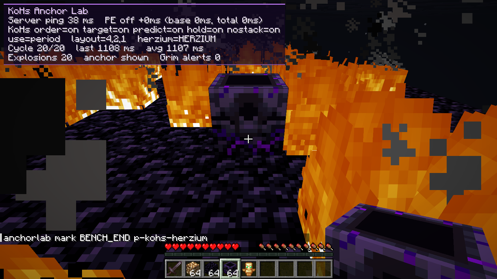

# Anchors and Herzium: the item behind each click (0.2.1)

Measured on 27 September 2026 on Minecraft 26.2 with the lab of
[KoHs Debug Tools, `anchors-debug/`](https://github.com/kerlycanelita/KoHs-Debug-Tools-for-KoHs-Mods/tree/main/anchors-debug)
(a local server with Grim Anticheat). The raw data is in `testlab/results/herzium-kohs-0.2.0/` and
`testlab/results/herzium-kohs-0.2.1/`.

The report: with KoHs Anchor's 0.2.0 and Herzium 1.10.5, anchor PvP "feels strange when charging and
exploding". The player has the right mouse button remapped to the period key, and in Minecraft "use"
is on that key.

## Verdict

- **The period key is not the cause.** The same bench with "use" on the right mouse button gives
  exactly the same result: 0 % with 0.2.0 and 100 % with 0.2.1.
- **The cause was the hotbar order.** The player presses "slot, use, another slot" in the same tick
  (clicks and immediately switches to the next item). 0.2.0 only reordered when Vanilla would give
  the use another item, and left to the hotbar pass the case where the later key is a lower slot.
  Herzium, in its default order (last input), applies that last key before the use, so the click
  went out with the next item: **glowstone instead of the anchor, and the sword instead of the
  glowstone**. With the player's hotbar (sword 1, glowstone 2, obsidian 3, anchors 4, totem 5), two
  of the three transitions fall into that case.
- **Herzium alone fails too.** Without KoHs Anchor's, each click does the next one's job (0 % in the
  first two tests). It is a Herzium bug and was sent to its chat with these tests.
- **0.2.0 also stacked anchors.** Releasing several held clicks with the same item together placed
  one anchor on top of another, and Grim flagged it (`AirLiquidPlace`).

## The player's setup

Read from their 26.2 instance, without changing it:

| What | Value |
| --- | --- |
| Use | `key.keyboard.period` (the right mouse button sends ".") |
| Hotbar keys | R, C, F, 4, M, G, 2, 8, 3 |
| Herzium | 1.10.5, `hotbarOrder: HERZIUM` (last input); the same jar as the release |
| KoHs Anchor's | 0.2.0, every option on; the same jar as `dist/0.2.0` |
| Anchor PvP hotbar | the mctiers kit from Crystal Tweaks: sword, glowstone, obsidian, anchors, totem |

Crystal Tweaks and Inventory Tweaks, also installed, do not touch "use" clicks or the hotbar keys
(Inventory Tweaks only acts on the inventory key).

## How it was measured

The bench presses the keys through Minecraft's keyboard and mouse handlers, with "use" on the period
key like the player. Herzium is installed and its order is changed live. Every cycle starts on a
rebuilt platform, so a misplaced block does not spoil the following cycles. Three tests:

| Test | What it does |
| --- | --- |
| One action per tick | Every client tick gets "item key, use, next item key" (20 cycles). |
| Fast rhythm | A click every 35 ms and the next item's key 10 ms after each click, at a random point of the tick (30 cycles). |
| Repeated clicks | Place, charge and detonate, and three more clicks for the next anchor while the previous one explodes, with +50 ms of lag (20 cycles). |

For every click, the slot it was applied with is compared with the one the action needs (place with
anchors, charge with glowstone, detonate with the sword). Every block the server placed outside the
anchor's spot, the clicks the server processed without effect and the Grim alerts are counted too.
`testlab/itemcheck.py` computes it.

## Results

Anchors done (placed, charged and detonated by the server), clicks with another item and misplaced
blocks:

| Test | Setup | 0.2.0 | 0.2.1 |
| --- | --- | --- | --- |
| One action per tick | **KoHs + Herzium last input (the player)** | 0 % · 40 with another item · 20 misplaced glowstone | **100 % · 0 · 0** |
| | Same, "use" on the right button | 0 % · 40 · 20 | **100 % · 0 · 0** |
| | KoHs + Herzium in Vanilla order | 100 % | 100 % |
| | Herzium alone (last input) | 0 % · 60 · 40 | 0 % · 60 · 40 |
| | Vanilla (Herzium in Vanilla order, KoHs off) | 100 % | 100 % |
| Fast rhythm | **KoHs + Herzium last input (the player)** | 76.7 % · 7 charges with the sword | **100 % · 0 · 0** |
| | KoHs + Herzium in Vanilla order | 63.3 % · 11 detonations with glowstone | **100 % · 0 · 0** |
| | Herzium alone (last input) | 0 % · 71 · 46 | 0 % · 72 · 46 |
| | Vanilla | 23.3 % · 62 · 40 | 23.3 % · 59 · 38 |
| Repeated clicks (+50 ms) | **KoHs + Herzium last input (the player)** | 100 % · 13 stacked anchors · 27 Grim alerts | **100 % · 0 stacked · 0 alerts** |
| | Herzium alone (last input) | 100 % · 21 stacked anchors | 100 % · 20 stacked anchors |

In Vanilla the detonation goes out with the anchor in hand instead of the sword (the sword's key is
lost to the higher slot), but a charged anchor also explodes with another anchor in hand. That is why
that row reaches 100 % even though it counts 20 clicks with another item.

## What changed in 0.2.1

1. **Full pressed order.** Every anchor burst that mixes hotbar keys and uses is applied in the
   order it was pressed, and the last key stays selected. Only a burst whose keys all come before the
   uses and are the same slot is left to the hotbar pass, because there every hotbar order gives the
   same result (Vanilla, Herzium or any other).
2. **Held clicks without duplicates.** A repeated click with the same item on the exploding anchor
   joins the one already waiting. If the server never removes that anchor, the waiting clicks are
   dropped instead of landing on it.
3. **Target refreshed only when the item changed.** A second use with the same item keeps the first
   one's target, as in Vanilla, instead of aiming at the anchor just placed.
4. **New option "No stacked anchors"** (on by default). In anchor play, a second use with the same
   item in the same tick is a double click and joins the first. It was needed because of the fire an
   explosion leaves: fire is replaceable, so a double click with anchors replaced it with the first
   and stacked the second on top, in Vanilla too. Charging with glowstone on an anchor is not
   limited, because where the anchor sets the spawn point charging twice makes sense.

## What belongs to Herzium

Sent to Herzium's chat with these tests:

1. **Last input applies a key pressed after the use.** With "slot A, use, slot B" in one tick, the
   use goes out with B. It also affects crystal PvP: "obsidian, use, crystal" places with the
   crystal. The proposal is to count use and attack presses, let the last slot pressed before the
   first pending action win, and leave later keys queued for the next tick.
2. **The preview suspends itself if another mod picks the slot inside the pass.** In Vanilla order,
   when KoHs Anchor's applies the pressed order, the final slot does not match the one Herzium
   predicted and Herzium suspends its preview in that world. It is only visual and does not happen in
   last input, the player's order.

Herzium's chat answered with **Herzium 1.10.6** (built, not released), measured with the same script
(`testlab/results/herzium-1.10.6-kohs-0.2.1/`):

| Test | Herzium 1.10.5 | Herzium 1.10.6 |
| --- | --- | --- |
| Herzium alone, one action per tick | 0 % · 60 with another item · 40 misplaced | **100 % · 0 · 0** |
| Herzium alone, fast rhythm | 0 % · 72 · 46 | 53 % · 14 · 0 |
| KoHs 0.2.1 + Herzium, every test | 100 % · 0 · 0 | 100 % · 0 · 0 |
| Preview with KoHs in Vanilla order | suspends | no longer suspends |

What remains for Herzium alone are ticks with two uses ("use, glowstone, use"): 14 misses at the
fast rhythm. The middle key waits for the next tick and the second use goes out with the previous
slot. Covering it would take two slot changes in one tick, which is what KoHs Anchor's does with
anchor bursts.

## Fair play

Everything is still a click by the player. 0.2.1 creates and repeats no click. The clicks it leaves
unapplied are repeats with the same item on the same anchor in the same tick, or held clicks whose
anchor never went away. In Vanilla they would fail or stack a block. With 0.2.1, Grim raised no
alert in any test; with 0.2.0 it raised 27 when repeated clicks were released.

## Limits

- The input is synthetic. The 35 ms and 10 ms of the fast rhythm model a fast player.
- The hotbar was taken from the player's mctiers kit in Crystal Tweaks. It can differ on every
  server; the 0.2.0 failure depended on the next key being a lower slot.
- Only 26.2 was measured. The other versions compile and their injection points are checked against
  their bytecode.
