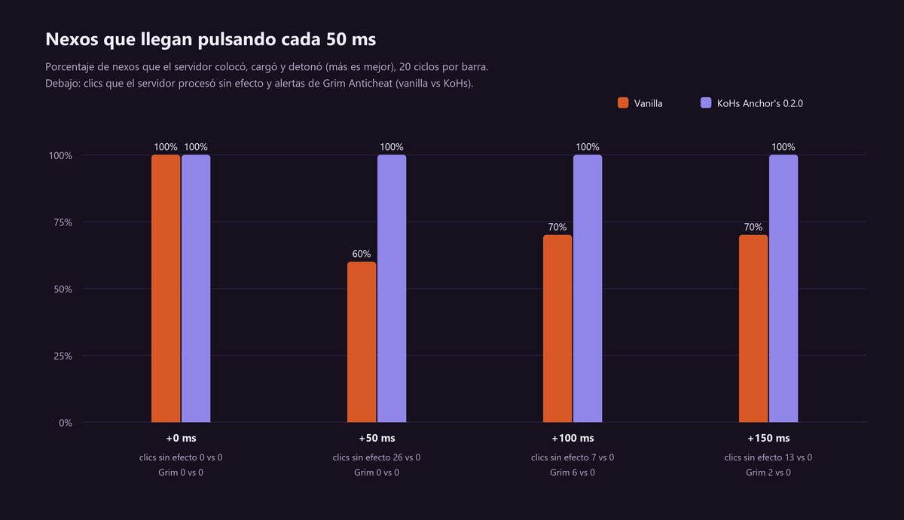

# Laboratorio de servidor: el nexo a velocidad real (0.2.0)

Medido el 27 de septiembre de 2026 en Minecraft 26.2, contra un servidor local con **Grim
Anticheat** y lag añadido con **Ravenclaw's Ping Equalizer**. Las herramientas están en
[KoHs Debug Tools, `anchors-debug/`](https://github.com/kerlycanelita/KoHs-Debug-Tools-for-KoHs-Mods/tree/main/anchors-debug)
y los datos en bruto en `anchors-debug/testlab/results/`.

La pregunta: *"el optimizador está muy lento en servidor"*. ¿A qué velocidad real se puede
colocar, cargar y detonar un nexo contra un servidor con latencia y anticheat, y qué la limita?

## Resultado en una frase

Con lag, Vanilla obliga a esperar a ver desaparecer el nexo anterior: cada clic temprano se
pierde contra el nexo viejo. La 0.2.0 retiene ese clic hasta que el servidor libera el bloque y
lo aplica en ese instante, así que se puede pulsar a ritmo sin mirar: **152–165 ms por nexo con
0 a +150 ms de lag, 100 % de nexos, 0 clics perdidos y 0 alertas de Grim**, frente a 325–487 ms
de un jugador que en Vanilla espera y reacciona.

## El entorno

| Pieza | Qué es |
| --- | --- |
| Servidor | Minecraft 26.2 con Fabric Loader 0.19.3 y Fabric API 0.157.0, en `127.0.0.1:25565`, modo offline, mundo plano. |
| Anticheat | Grim Anticheat para Fabric 2.3.74 (`8eb5f28`), configuración por defecto; cada alerta va a la consola del servidor. |
| Lag | Ravenclaw's Ping Equalizer 1.5 en el cliente, modo *add*: +0, +50, +100 y +150 ms. |
| Cliente | Cliente de desarrollo 26.2 con KoHs Anchor's, Mod Menu y KoHs Anchor Debug. |
| Escenario | Plataforma de obsidiana en el aire, nexo siempre en el mismo bloque, jugador en supervivencia con Resistencia IV, resistencia al fuego y sin empuje, para detonar cientos de nexos seguidos. Barra: nexo (1), glowstone (2), tótem (3). |

**KoHs Anchor Debug** tiene dos mitades, las dos apagadas salvo que se arranquen con su propiedad
de laboratorio:

- En el servidor (`-Dkohs.anchorlab=true`) construye la plataforma, prepara al jugador, añade
  `/anchorlab` y anota qué hizo el servidor con cada clic: colocar, cargar, explotar y el
  resultado de cada uso.
- En el cliente (`-Dkohs.anchorlab.client=true`) anota cada pulsación, cada paquete enviado,
  cada cambio de bloque y cada explosión recibida, muestra el panel del laboratorio y ejecuta un
  guion. El banco solo acepta el servidor de esta máquina (`localhost` o `127.0.0.1`); rechaza
  un mundo individual y cualquier otra dirección.

El banco pulsa tecla numérica + clic derecho a través de los manejadores de teclado y ratón de
Minecraft, igual que un teclado real: KoHs Anchor's no sabe que es un banco. Cliente y servidor
escriben con microsegundos del mismo reloj de la máquina, así que sus eventos se alinean sin
ajustes. Un nexo cuenta como logrado cuando el servidor lo colocó, lo cargó y lo hizo explotar.
El tiempo real por nexo es el tiempo desde el primer clic hasta la última explosión del servidor,
dividido entre los nexos que explotaron.

| Modo del banco | A quién representa |
| --- | --- |
| `react 50+180` | Un jugador real sin el mod: espera a ver desaparecer el nexo anterior, reacciona en 180 ms y deja 50 ms entre acciones. |
| `fixed 50` | Pulsar a ritmo, una acción cada 50 ms, sin mirar. |
| `adaptive 50` | Un jugador perfecto: empieza el siguiente nexo en el instante exacto en que el anterior desaparece. |
| `adaptive 0` (ráfaga) | Colocar, cargar y detonar dentro del mismo tick del cliente. |

Cada prueba son 20 nexos y la plataforma se reconstruye antes de cada una.

## Resultados de la 0.2.0

Milisegundos por nexo y porcentaje de nexos logrados. *Sin efecto* son usos que el servidor
procesó y no hicieron nada (el clic se perdió).

| Lag añadido | Vanilla, jugador real (`react`) | Vanilla a ritmo (`fixed 50`) | KoHs 0.2.0 a ritmo (`fixed 50`) |
| --- | --- | --- | --- |
| +0 ms | 324.6 ms · 100 % | 149.8 ms · 100 % | **152.2 ms · 100 %** |
| +50 ms | 389.8 ms · 100 % | 253.9 ms · 60 % · 26 sin efecto | **152.3 ms · 100 %** |
| +100 ms | 422.3 ms · 100 % | 206.9 ms · 70 % · 7 sin efecto · Grim `AirLiquidPlace` ×6 | **164.8 ms · 100 %** |
| +150 ms | 487.3 ms · 100 % | 156.6 ms · 70 % · 13 sin efecto · Grim `AirLiquidPlace` ×2 | **162.3 ms · 100 %** |

KoHs 0.2.0 no tuvo ningún clic sin efecto ni ninguna alerta de Grim en toda la matriz.

Otras dos pruebas de la misma sesión:

| Prueba | Vanilla | KoHs 0.2.0 |
| --- | --- | --- |
| Ráfaga en un tick, +50 ms | 20 % de nexos, 88 usos sin efecto | **100 %, 99.8 ms por nexo (10.02 nexos/s)** |
| Jugador perfecto (`adaptive 50`), +100 ms | 289.8 ms · 100 % | 282.2 ms · 100 % |

### Qué significa

1. **Lo lento era esperar.** El jugador de Vanilla tiene que ver el nexo anterior desaparecer
   antes de colocar el siguiente, porque un clic temprano cae sobre el nexo viejo y se pierde.
   Esa espera es un viaje de ida y vuelta más su reacción, y crece con el lag: de 325 a 487 ms.
2. **Pulsar a ritmo en Vanilla pierde nexos.** Con 50 ms entre acciones y lag, entre el 30 y el
   40 % de los nexos no llegan: la carga o la detonación caen sobre un bloque que en el servidor
   ya no es el nexo. A +100 y +150 ms Grim marcó además varios clics como `AirLiquidPlace`
   (colocar contra aire): apuntaban al nexo viejo, que en el servidor ya era aire.
3. **Con la 0.2.0, no esperar es lo más rápido.** El clic temprano espera en el cliente hasta que
   llega el estado del servidor para ese bloque, y entonces se aplica, apuntado de nuevo al bloque
   libre, con el objeto que tenías al pulsarlo. El ritmo del jugador se conserva aunque cada nexo
   llegue un viaje de ida y vuelta más tarde: **2.1× más rápido que el jugador real de Vanilla
   sin lag y 3.0× con +150 ms.**
4. **El límite físico es el servidor.** Un jugador que espera a ver el bloque libre (`adaptive`)
   tarda lo mismo con o sin el mod (290 frente a 282 ms con +100): nada en el cliente hace que
   el servidor borre el nexo antes. La ventaja de la 0.2.0 está en no tener que esperar.

## Tres intentos, la misma prueba

Pulsar cada 50 ms con +100 ms de lag, con cada versión que se probó:

| Versión | Idea | Nexos logrados | Sin efecto | Grim |
| --- | --- | --- | --- | --- |
| Vanilla | — | 30–70 % | 7–38 | `AirLiquidPlace` ×1–6 |
| 0.1.0 | Orden real y objetivo actualizado | 10 % | 19 | `AirLiquidPlace` ×47 |
| Borrador 0.2.0 | Quitar el nexo del mundo del cliente al detonar | 60 % | 15 | `AirLiquidPlace` ×2 |
| **0.2.0** | **Retener el clic temprano hasta que el servidor libera el bloque** | **100 %** | **0** | **ninguna** |

La 0.1.0 arreglaba los clics perdidos dentro de un tick, pero no tenía nada para el clic que llega
antes que la explosión del servidor.

El borrador probó lo que hacen otros mods: dar el nexo por destruido en el cliente en cuanto se
detona. En ráfaga llegó a 53 ms por nexo, pero Grim modela cada bloque según lo que el cliente ya
ha recibido: el siguiente nexo llegaba antes que la noticia de la explosión, Grim veía un clic
imposible, lo marcaba (`AirLiquidPlace`) y lo cancelaba. Un cliente Vanilla no puede producir esa
secuencia, así que se descartó. La 0.2.0 deja el bloque al servidor y solo decide *cuándo*
aplicar un clic que ya diste: el momento más temprano que Grim acepta.

## La nueva vista previa 3D

La pantalla de ajustes muestra un nexo de reaparición de verdad: el modelo y las texturas del
juego, dibujados por el propio renderizado de bloques de Minecraft con luz plena. Se gira
arrastrando con el ratón, se acerca con la rueda y un clic lo carga; tras unos segundos sin
tocarlo vuelve a girar solo. En 1.21.11 y 26.1.x el mismo código usa la API de esas versiones:
compila y se verifica en cada build, pero en juego solo se probó 26.2.

| Girado con el ratón | Cargado |
| --- | --- |
|  |  |

## Fair play

| Función | ¿Lo ve el servidor? | Resultado en el laboratorio |
| --- | --- | --- |
| Orden real de clics | Sí: los paquetes salen en el orden en que pulsaste | 0 alertas de Grim |
| Objetivo actualizado | Sí: el uso apunta al bloque nuevo, con el raycast de Vanilla | 0 alertas de Grim |
| Clic anticipado | Sí: el clic sale cuando el bloque ya está libre para el cliente | 0 alertas de Grim; como mucho 6 clics y 0.7 s de espera, cada uno aplicado una vez |
| Detonación instantánea | No: solo sonido y destello en el cliente | — |

Ninguna función crea, repite ni elige un clic por el jugador, y ninguna escribe paquetes propios.

## Límites de la medición

- La entrada es sintética. Los 180 ms de reacción son un modelo, no una medición de personas.
- Servidor local sin pérdida de paquetes ni variación del ping: el lag lo añade Ping Equalizer.
- Solo Grim 2.3.74 con su configuración por defecto; otros anticheats no se probaron.
- Solo se midió 26.2. Las demás versiones compilan y sus puntos de inyección se verifican contra
  el bytecode, pero no pasaron por el laboratorio.
- 20 nexos por prueba: cada nexo es un 5 %.
- El daño y el empuje no se midieron (el jugador los tenía anulados).

## Reproducirlo

Los pasos están en el README de
[`anchors-debug/`](https://github.com/kerlycanelita/KoHs-Debug-Tools-for-KoHs-Mods/tree/main/anchors-debug):
arrancar el servidor del laboratorio, ejecutar `run-matrix.ps1` con una etiqueta, y después
`analyze.py` y `charts.py` sobre `results/<etiqueta>/`.
