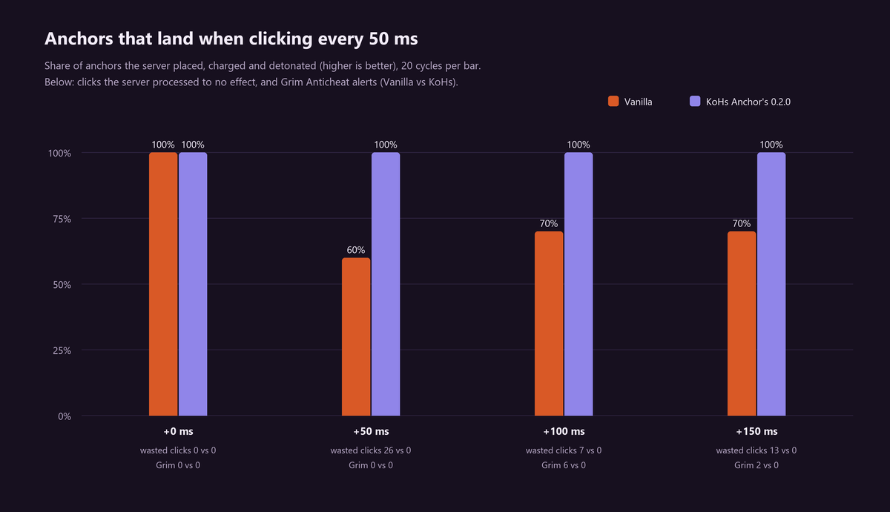

# Server lab: anchors at real speed (0.2.0)

Measured on 27 September 2026 on Minecraft 26.2, against a local server with **Grim Anticheat** and
latency added with **Ravenclaw's Ping Equalizer**. The tools are in
[KoHs Debug Tools, `anchors-debug/`](https://github.com/kerlycanelita/KoHs-Debug-Tools-for-KoHs-Mods/tree/main/anchors-debug)
and the raw data in `anchors-debug/testlab/results/`.

The question: *"the optimizer is very slow on servers"*. How fast can an anchor really be placed,
charged and detonated against a server with latency and an anticheat, and what limits it?

## The result in one sentence

With latency, Vanilla makes you wait to see the previous anchor disappear: every early click is
lost on the old anchor. 0.2.0 holds that click until the server frees the block and applies it at
that moment, so you can press at a rhythm without looking: **152–165 ms per anchor with 0 to +150 ms
of lag, 100 % of anchors, 0 lost clicks and 0 Grim alerts**, against 325–487 ms for a Vanilla
player who waits and reacts.

## The setup

| Part | What it is |
| --- | --- |
| Server | Minecraft 26.2 with Fabric Loader 0.19.3 and Fabric API 0.157.0, on `127.0.0.1:25565`, offline mode, flat world. |
| Anticheat | Grim Anticheat for Fabric 2.3.74 (`8eb5f28`), default configuration; every alert goes to the server console. |
| Latency | Ravenclaw's Ping Equalizer 1.5 on the client, *add* mode: +0, +50, +100 and +150 ms. |
| Client | 26.2 development client with KoHs Anchor's, Mod Menu and KoHs Anchor Debug. |
| Scene | An obsidian platform in the air, the anchor always on the same block, the player in survival with Resistance IV, fire resistance and no knockback, to detonate hundreds of anchors in a row. Hotbar: anchor (1), glowstone (2), totem (3). |

**KoHs Anchor Debug** has two halves, both off unless started with their lab property:

- On the server (`-Dkohs.anchorlab=true`) it builds the platform, prepares the player, adds
  `/anchorlab` and records what the server did with each click: place, charge, explode and the
  result of every use.
- On the client (`-Dkohs.anchorlab.client=true`) it records every press, every packet sent, every
  block change and every explosion received, shows the lab panel and runs a script. The bench only
  accepts the server on this machine (`localhost` or `127.0.0.1`); it refuses singleplayer and any
  other address.

The bench presses a number key + right click through Minecraft's keyboard and mouse handlers, just
like a real keyboard: KoHs Anchor's does not know it is a bench. Client and server write
microseconds of the same machine clock, so their events line up without adjustment. An anchor
counts as done when the server placed it, charged it and made it explode. The real time per anchor
is the time from the first click to the server's last explosion, divided by the anchors that
exploded.

| Bench mode | Who it stands for |
| --- | --- |
| `react 50+180` | A real player without the mod: waits to see the previous anchor disappear, reacts in 180 ms and leaves 50 ms between actions. |
| `fixed 50` | Pressing at a rhythm, one action every 50 ms, without looking. |
| `adaptive 50` | A perfect player: starts the next anchor the exact moment the previous one disappears. |
| `adaptive 0` (burst) | Place, charge and detonate inside the same client tick. |

Each test is 20 anchors, and the platform is rebuilt before each one.

## 0.2.0 results

Milliseconds per anchor and percentage of anchors done. *No effect* are uses the server processed
that did nothing (the click was lost).

| Added latency | Vanilla, real player (`react`) | Vanilla at rhythm (`fixed 50`) | KoHs 0.2.0 at rhythm (`fixed 50`) |
| --- | --- | --- | --- |
| +0 ms | 324.6 ms · 100 % | 149.8 ms · 100 % | **152.2 ms · 100 %** |
| +50 ms | 389.8 ms · 100 % | 253.9 ms · 60 % · 26 no effect | **152.3 ms · 100 %** |
| +100 ms | 422.3 ms · 100 % | 206.9 ms · 70 % · 7 no effect · Grim `AirLiquidPlace` ×6 | **164.8 ms · 100 %** |
| +150 ms | 487.3 ms · 100 % | 156.6 ms · 70 % · 13 no effect · Grim `AirLiquidPlace` ×2 | **162.3 ms · 100 %** |

KoHs 0.2.0 had no click without effect and no Grim alert in the whole matrix.

Two more tests from the same session:

| Test | Vanilla | KoHs 0.2.0 |
| --- | --- | --- |
| Burst in one tick, +50 ms | 20 % of anchors, 88 uses without effect | **100 %, 99.8 ms per anchor (10.02 anchors/s)** |
| Perfect player (`adaptive 50`), +100 ms | 289.8 ms · 100 % | 282.2 ms · 100 % |

### What it means

1. **Waiting was the slow part.** The Vanilla player has to see the previous anchor disappear
   before placing the next, because an early click lands on the old anchor and is lost. That wait is
   a round trip plus their reaction, and it grows with latency: from 325 to 487 ms.
2. **Pressing at a rhythm in Vanilla loses anchors.** With 50 ms between actions and latency, 30 to
   40 % of the anchors do not happen: the charge or the detonation lands on a block that, on the
   server, is no longer the anchor. At +100 and +150 ms Grim also flagged several clicks as
   `AirLiquidPlace` (placing against air): they aimed at the old anchor, which on the server was
   already air.
3. **With 0.2.0, not waiting is fastest.** The early click waits on the client until the server's
   state for that block arrives, and is then applied, aimed again at the free block, with the item
   you held when you pressed it. The player's rhythm is kept even though each anchor arrives a round
   trip later: **2.1× faster than the real Vanilla player without lag, and 3.0× with +150 ms.**
4. **The physical limit is the server.** A player who waits to see the block free (`adaptive`) takes
   the same time with or without the mod (290 against 282 ms at +100): nothing on the client makes
   the server remove the anchor sooner. 0.2.0's advantage is not having to wait.

## Three attempts, the same test

Pressing every 50 ms with +100 ms of lag, with each version that was tried:

| Version | Idea | Anchors done | No effect | Grim |
| --- | --- | --- | --- | --- |
| Vanilla | — | 30–70 % | 7–38 | `AirLiquidPlace` ×1–6 |
| 0.1.0 | Pressed order and fresh target | 10 % | 19 | `AirLiquidPlace` ×47 |
| 0.2.0 draft | Remove the anchor from the client's world on detonation | 60 % | 15 | `AirLiquidPlace` ×2 |
| **0.2.0** | **Hold the early click until the server frees the block** | **100 %** | **0** | **none** |

0.1.0 fixed the clicks lost inside one tick, but had nothing for the click that arrives before the
server's explosion.

The draft tried what other mods do: treat the anchor as destroyed on the client as soon as it is
detonated. In a burst it reached 53 ms per anchor, but Grim models every block from what the client
has already received: the next anchor arrived before the news of the explosion, Grim saw an
impossible click, flagged it (`AirLiquidPlace`) and cancelled it. A Vanilla client cannot produce
that sequence, so it was dropped. 0.2.0 leaves the block to the server and only decides *when* to
apply a click you already made: the earliest moment Grim accepts.

## The new 3D preview

The settings screen showed a real respawn anchor for the first time: the game's model and textures,
drawn by Minecraft's own block renderer at full brightness. Drag to turn it, scroll to zoom, click
to charge it; after a few idle seconds it turns on its own again. On 1.21.11 and 26.1.x the same code
uses those versions' API: it compiles and is verified in every build, but only 26.2 was played. The
0.4.0 screen, which keeps this preview, is in the [README's gallery](../../README.md#gallery).

## Fair play

| Feature | Does the server see it? | Lab result |
| --- | --- | --- |
| Pressed order | Yes: packets go out in the order you pressed | 0 Grim alerts |
| Fresh target | Yes: the use aims at the new block, with Vanilla's raycast | 0 Grim alerts |
| Early click | Yes: the click goes out once the block is free for the client | 0 Grim alerts; at most 6 clicks and 0.7 s of waiting, each applied once |
| Instant detonation | No: only sound and flash on the client | — |

No feature creates, repeats or chooses a click for the player, and none writes packets of its own.

## Limits of the measurement

- The input is synthetic. The 180 ms of reaction are a model, not a measurement of people.
- A local server with no packet loss and no ping variation: the lag is added by Ping Equalizer.
- Only Grim 2.3.74 with its default configuration; other anticheats were not tested.
- Only 26.2 was measured. The other versions compile and their injection points are checked
  against their bytecode, but they did not go through the lab.
- 20 anchors per test: each anchor is 5 %.
- Damage and knockback were not measured (the player had them cancelled).

## Reproducing it

The steps are in the README of
[`anchors-debug/`](https://github.com/kerlycanelita/KoHs-Debug-Tools-for-KoHs-Mods/tree/main/anchors-debug):
start the lab server, run `run-matrix.ps1` with a label, then `analyze.py` and `charts.py` on
`results/<label>/`.
